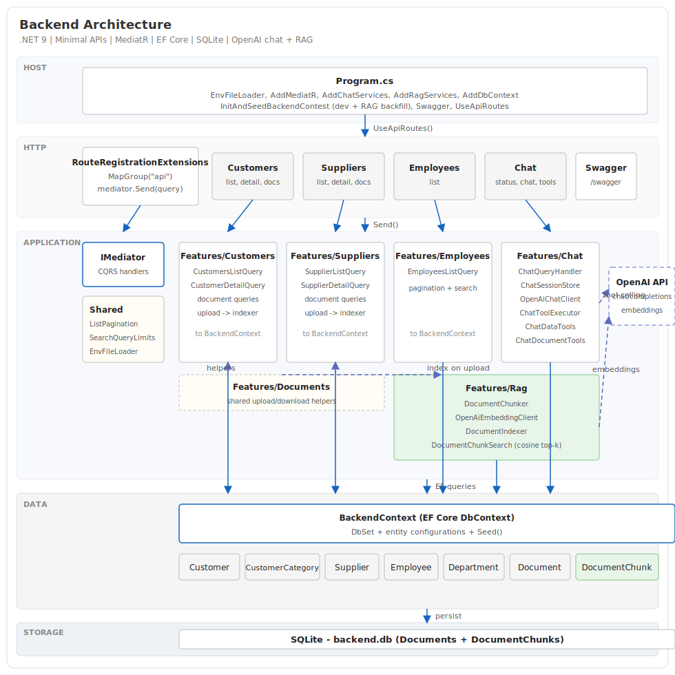
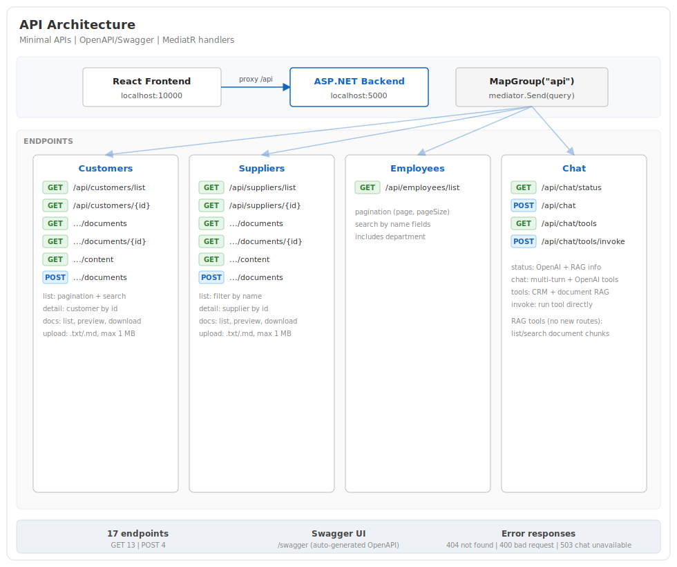
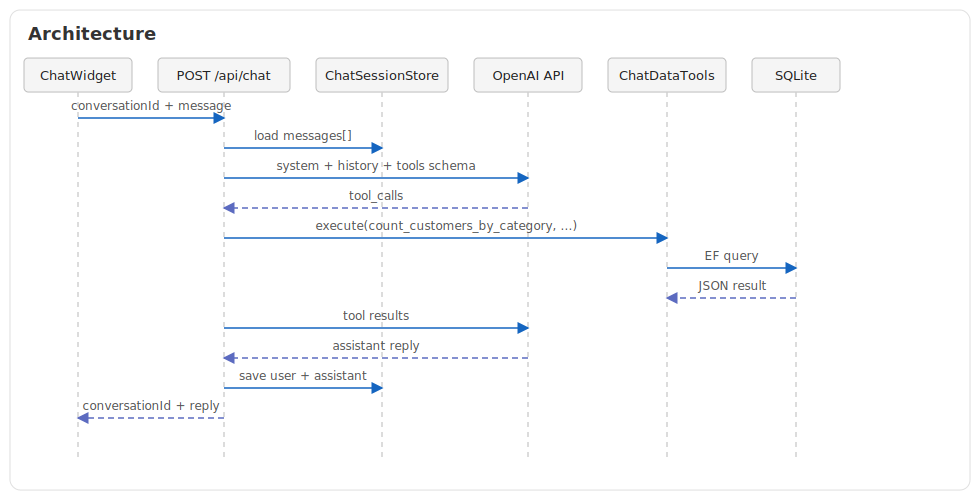

# Assessment exercise

Assessment exercise for backend and frontend developer, preconfigured to work with GitHub Codespaces.

## Stack

- **Backend:** .NET 9, MediatR, EF Core, SQLite
- **Frontend:** React, TypeScript, Vite, MUI





## Getting started

1. Open the repo in GitHub Codespaces (or locally with .NET 9 and Node.js).
2. Install frontend dependencies (Codespaces runs this automatically via `postCreateCommand`):

   ```bash
   npm install --prefix src/Frontend
   ```

3. Start the backend (port 5000):

   ```bash
   cd src/Backend
   dotnet run
   ```

   Or use the VS Code task **Run Backend**.

4. Start the frontend (port 10000, proxies `/api` to the backend):

   ```bash
   npm run dev --prefix src/Frontend
   ```

5. Open `http://localhost:10000`.

Swagger is available at `http://localhost:5000/swagger` when the backend is running.

## AI chat

The app includes a floating chat widget (bottom-right) that answers natural-language questions about **Customers** and **Suppliers** using OpenAI and live database data.

### Setup

1. Copy the example env file:

   ```bash
   cp src/Backend/.env.example src/Backend/.env.local
   ```

2. Set your OpenAI API key in `src/Backend/.env.local`:

   ```bash
   OPENAI_API_KEY=sk-your-key-here
   OPENAI_MODEL=gpt-4o-mini
   ```

   `OPENAI_MODEL` is optional (defaults to `gpt-4o-mini`). Never commit `.env.local`.

3. Restart the backend after changing env vars.

Without an API key, the backend still starts; chat returns `503` and the widget shows a configuration warning.

### How it works



- **LLM:** OpenAI Chat Completions API (`gpt-4o-mini`) with **tool calling**
- **Data retrieval:** the model picks from EF-backed tools; the backend runs the query and returns JSON results to the model for the final answer
- **History:** server-side in-memory sessions keyed by `conversationId` (multi-turn follow-ups supported)

### Chat API

| Method | Endpoint | Description |
|--------|----------|-------------|
| `GET` | `/api/chat/status` | Whether OpenAI is configured and which model is used |
| `POST` | `/api/chat` | Send a message; optional `conversationId` for follow-ups |
| `GET` | `/api/chat/tools` | List available data-retrieval tools |
| `POST` | `/api/chat/tools/invoke` | Invoke a tool directly (for testing) |

`POST /api/chat` body:

```json
{
  "conversationId": "optional-guid-from-previous-response",
  "message": "Quanti clienti ci sono nella categoria Garden?"
}
```

### Example questions

- "Quanti clienti ci sono nella categoria Garden?"
- "Quali fornitori hanno email su dominio gmail.com?"
- "Qual è l'IBAN del cliente Acquadro?"

Follow-up questions (e.g. "mostrami i loro dati") use the same `conversationId` from the previous response.

### Limits

- Message length: 100 characters (same as list search filters)
- Session history: last 40 messages per conversation (system prompt retained)
- OpenAI request timeout: 60 seconds
- Tool search results: max 20 rows per query
