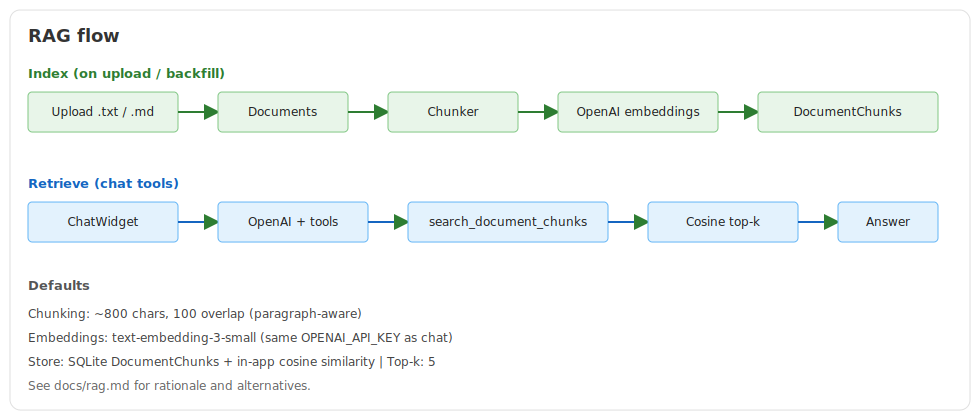

# Assessment exercise

Assessment exercise for backend and frontend developer, preconfigured to work with GitHub Codespaces.

## Stack

- **Backend:** .NET 9, MediatR, EF Core, SQLite
- **Frontend:** React, TypeScript, Vite, MUI


## Getting started

1. Open the repo in GitHub Codespaces (or locally with .NET 9 and Node.js).
2. Install frontend dependencies (Codespaces runs this automatically via `postCreateCommand`):

   ```bash
   npm install --prefix src/Frontend
   ```

3. Start the backend (port 5000):

   ```bash
   cd src/Backend
   dotnet run
   ```

   Or use the VS Code task **Run Backend**.

4. Start the frontend (port 10000, proxies `/api` to the backend):

   ```bash
   npm run dev --prefix src/Frontend
   ```

5. Open `http://localhost:10000`.

Swagger is available at `http://localhost:5000/swagger` when the backend is running.

## AI chat

The app includes a floating chat widget (bottom-right) that answers natural-language questions about **Customers**, **Suppliers**, and their **uploaded documents** using OpenAI, live EF Core data, and RAG over document chunks.

### Setup

1. Copy the example env file:

   ```bash
   cp src/Backend/.env.example src/Backend/.env.local
   ```

2. Set your OpenAI API key in `src/Backend/.env.local`:

   ```bash
   OPENAI_API_KEY=sk-your-key-here
   OPENAI_MODEL=gpt-4o-mini
   # optional — defaults to text-embedding-3-small
   # OPENAI_EMBEDDING_MODEL=text-embedding-3-small
   ```

   `OPENAI_MODEL` and `OPENAI_EMBEDDING_MODEL` are optional. Never commit `.env.local`.

3. Restart the backend after changing env vars.

Without an API key, the backend still starts; chat returns `503` and the widget shows a configuration warning. Document upload still works; indexing is skipped until a key is set.

### How it works


- **LLM:** OpenAI Chat Completions API (`gpt-4o-mini`) with **tool calling**
- **Structured data:** the model picks EF-backed tools (customers/suppliers); the backend runs the query and returns JSON
- **Documents (RAG):** uploads are chunked, embedded, and stored in SQLite; chat tools retrieve top-k chunks as context
- **History:** server-side in-memory sessions keyed by `conversationId` (multi-turn follow-ups supported)

### Documented choices (assessment requirement)

| Requirement | Choice |
|-------------|--------|
| **LLM** | OpenAI **`gpt-4o-mini`** via Chat Completions (`OPENAI_API_KEY` / optional `OPENAI_MODEL`) |
| **Data retrieval** | **Tool calling (hybrid):** the model selects EF Core–backed tools; the backend executes the query and returns JSON for the final answer (no free-text SQL from the LLM) |
| **Conversation history** | **Server-side in-memory** store keyed by `conversationId`; client sends the id on follow-ups; last **40** messages kept (system prompt retained); lost on process restart |

### Chat API

| Method | Endpoint | Description |
|--------|----------|-------------|
| `GET` | `/api/chat/status` | Whether OpenAI is configured, chat/embedding models, indexed chunk count |
| `POST` | `/api/chat` | Send a message; optional `conversationId` for follow-ups |
| `GET` | `/api/chat/tools` | List available tools (structured data + document RAG) |
| `POST` | `/api/chat/tools/invoke` | Invoke a tool directly (for testing) |

`POST /api/chat` body:

```json
{
  "conversationId": "optional-guid-from-previous-response",
  "message": "Quanti clienti ci sono nella categoria Garden?"
}
```

### Example questions

**Customers / suppliers**

- "Quanti clienti ci sono nella categoria Garden?"
- "Quali fornitori hanno email su dominio gmail.com?"
- "Qual è l'IBAN del cliente Acquadro?"

**Documents (RAG)**

- "What is the net earnings in the Acme report?"
- "Cosa diceva l'ultimo contratto del cliente X?"
- "Quali fornitori hanno menzionato problemi di consegna nei documenti?"

Follow-up questions (e.g. "mostrami i loro dati") use the same `conversationId` from the previous response.

### Limits

- Message length: 100 characters (same as list search filters)
- Session history: last 40 messages per conversation (system prompt retained)
- OpenAI request timeout: 60 seconds
- Tool search results: max 20 rows per structured query; RAG returns top-k **5** chunks

## RAG (document Q&A)

Upload `.txt` or `.md` files (max **1 MB**) on Customer or Supplier detail pages. On upload the backend:

1. Saves full text in `Documents` (source of truth for download/preview)
2. Splits text into chunks (~800 characters, 100-character overlap, paragraph-aware)
3. Embeds chunks with OpenAI and stores them in `DocumentChunks`

In **Development**, documents without chunks (including seed data) are **backfilled on startup** when `OPENAI_API_KEY` is set.

Chat then uses tools such as `list_documents_for_customer`, `list_documents_for_supplier`, and `search_document_chunks` so the model can answer from retrieved passages.



**Design choices and rationale** (why these options, rejected alternatives, phase history): see [docs/rag.md](docs/rag.md).

### Documented choices (assessment requirement)

| Requirement | Choice |
|-------------|--------|
| **Chunking strategy** | Paragraph-first (split on blank lines), merge up to ~**800** characters, **100**-character overlap; longer paragraphs are hard-split |
| **Embedding model** | OpenAI **`text-embedding-3-small`** (1536 dims), same `OPENAI_API_KEY` as chat |
| **Vector store** | Embedded SQLite: **`DocumentChunks`** table (text + JSON embedding) + in-process **cosine similarity** (no external vector DB) |
| **Top-k** | **5** most similar chunks per search |

Optional override: `OPENAI_EMBEDDING_MODEL` in `.env.local`.

**Free-tier alternative (not implemented):** Google `text-embedding-004` on AI Studio — would need a second provider key; one provider kept for simplicity.

Full rationale and rejected alternatives: [docs/rag.md](docs/rag.md).

### Sample file

A demo report lives at `samples/client-earnings-report.txt`. Upload it on a customer or supplier detail page, then ask chat about net earnings, fees, or June 2026 transactions.

### RAG limits

- Allowed types: `.txt`, `.md` only; max 1 MB
- Indexing requires `OPENAI_API_KEY` (upload still succeeds without it)
- Search query length: 100 characters
- Brute-force cosine over all matching chunks (fine for assessment-scale corpora)
